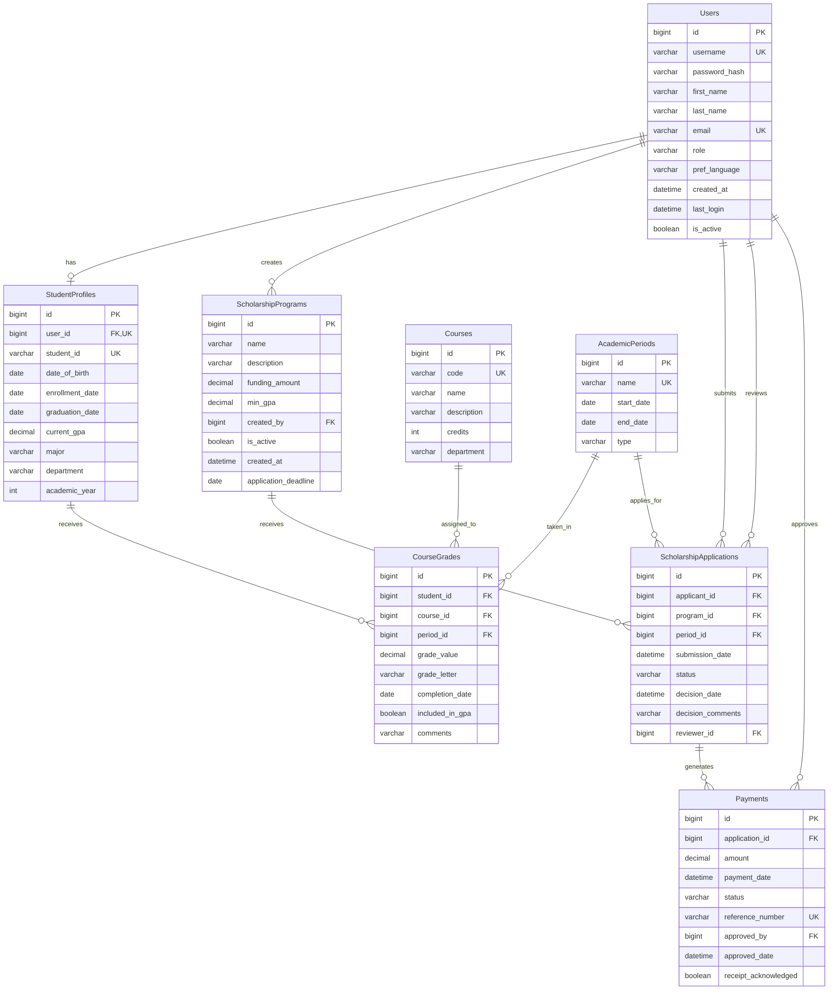

# Scholarship Calculation System - Database Diagram

## Entity Relationship Diagram

## Legend

- PK: Primary Key
- FK: Foreign Key
- UK: Unique Key

## Relationship Types

- `||--o|`: One-to-One relationship
- `||--o{`: One-to-Many relationship
- `}o--o{`: Many-to-Many relationship

## Key Relationships

1. A User can have one StudentProfile (if they are a student)
2. A StudentProfile belongs to exactly one User
3. A StudentProfile can have many CourseGrades
4. A Course can be associated with many CourseGrades
5. An AcademicPeriod can have many CourseGrades
6. An Admin User can create many ScholarshipPrograms
7. A Student User can submit many ScholarshipApplications
8. A ScholarshipProgram can receive many ScholarshipApplications
9. An AcademicPeriod can have many ScholarshipApplications
10. An Admin User can review many ScholarshipApplications
11. A ScholarshipApplication can generate many Payments
12. An Admin User can approve many Payments

This diagram provides a visual representation of the database schema described in the database-schema.md file.
